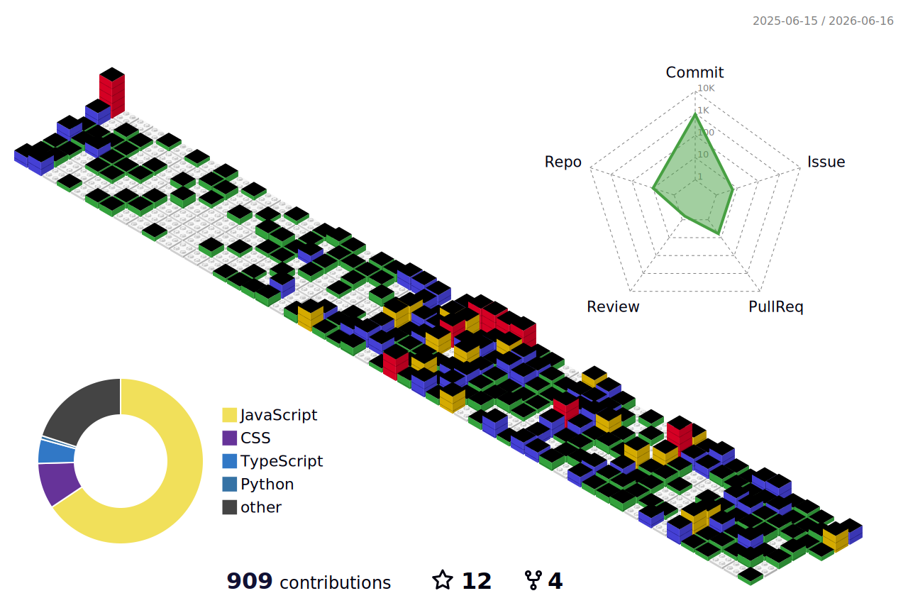

# Hi 👋, I'm louaq

  

 

  

 
<!-- 

  -->

- 🔭 I'm currently a MS student on **South-central Minzu University**

- 🌱 I'm currently learning **Multimodal Medical Image segmentation, Compouter Vision, Medical Image Processing**

- 🤝 I'm looking for help with **Brain Tumor Dataset**

- 💬 Ask me about **AI, Compouter Vision, Medical Image Processing**

- 📫 How to reach me **astroal@qq.com**

- ⚡ Fun fact **I think i am funny**

- 📝 I regularly write articles on **[https://louaq.io](https://louaq.io)**

<h3 align="left">Languages and Tools:</h3>

