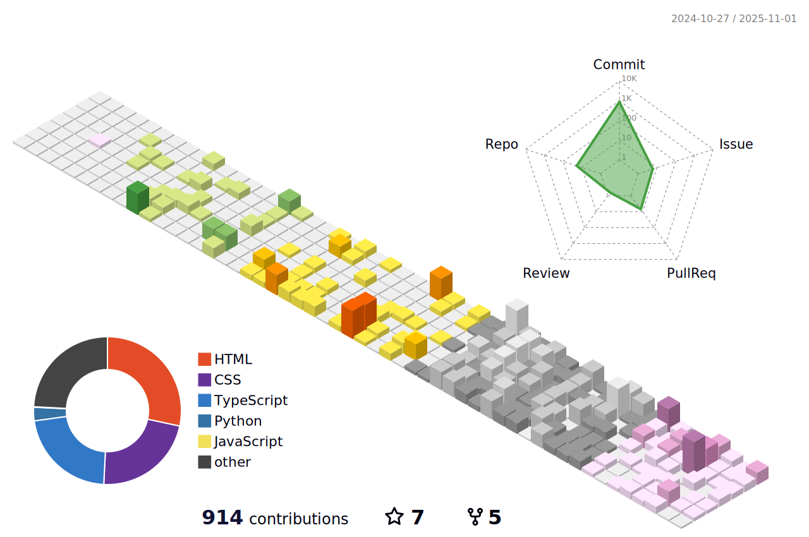

# Hi 👋, I'm louaq

  

 

 

- 🔭 I'm currently working on **South-central Minzu University**

- 🌱 I'm currently learning **Multimodal Medical Image segmentation, Compouter Vision, Medical Image Processing**

- 🤝 I'm looking for help with **learning system design**

- 💬 Ask me about **AI, Compouter Vision, Medical Image Processing**

- 📫 How to reach me **yang_syy@qq.com**

- ⚡ Fun fact **I think i am funny**

- 👨‍💻 All of my projects are available at **[https://louaq.github.io](https://louaq.github.io)**

- 📝 I regularly write articles on **[https://louaq.github.io](https://louaq.github.io)**

<h3 align="left">Connect with me:</h3>

<h3 align="left">Languages and Tools:</h3>

              

